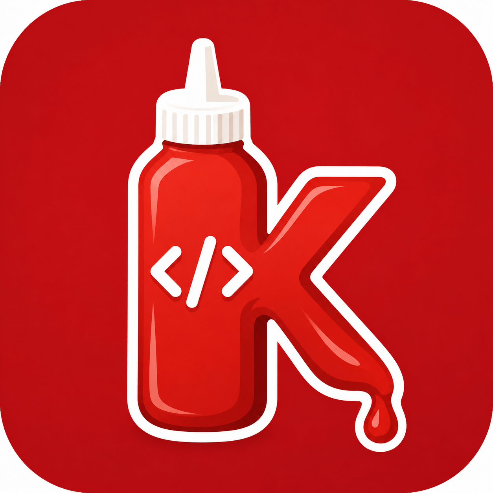
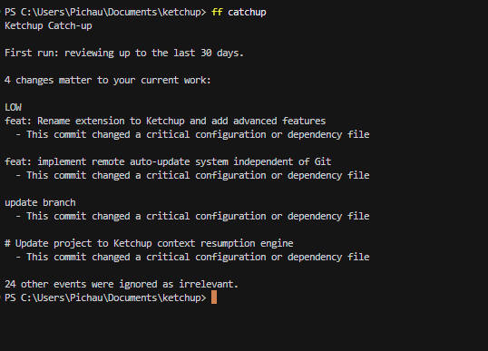

<div align="center">



# Ketchup

**Never run out of sync.**

Detect and synchronize drift between your local workspace and the expected project state — safely.

<br />

[](LICENSE)
[](go.mod)
[](https://marketplace.visualstudio.com/items?itemName=Reskyume.ketchup-fast-forward)
[](extension/package.json)

<br />

### Ketchup Fast-Forward is live!

**[Install on VS Code Marketplace →](https://marketplace.visualstudio.com/items?itemName=Reskyume.ketchup-fast-forward)**

Search for **"Ketchup Fast-Forward"** in VS Code Extensions.

</div>

---

## Highlights

<table align="center">
<tr>
<td align="center" width="25%">
<h3>Catch-up</h3>
Summarizes what changed since your last session — with <strong>file-level summaries</strong> per commit, relevance filtering, and noise reduction.
</td>
<td align="center" width="25%">
<h3>Safe by design</h3>
Checks are <strong>read-only</strong>. Changes only via <code>sync</code> with explicit confirmation. Git is <strong>fast-forward only</strong>.
</td>
<td align="center" width="25%">
<h3>Drift detection</h3>
Git, dependencies, and environment — compared against the expected state without exposing secrets.
</td>
<td align="center" width="25%">
<h3>VS Code extension</h3>
Sidebar panel, status bar, quick-fix actions, and auto-check — published as <strong>Ketchup Fast-Forward</strong>.
</td>
</tr>
</table>

> **Using Cursor?** Not in Cursor's marketplace yet. Install from VSIX: **Extensions → ... → Install from VSIX** → `extension/ketchup-fast-forward-0.3.0.vsix`

---

## See it in action

<div align="center">



<br />

*Run `ff catch-up` after time away — each commit shows which files changed and why it matters.*

</div>

**What you're seeing:**

| Output | Meaning |
|--------|---------|
| `4 changes matter to your current work` | Commits scored as **relevant** to your current context |
| `8 file(s): extension (package.json, ...) +2; CLI (main.go)` | **Summary of modified files** grouped by area |
| `→ Critical files changed: package.json` | Why Ketchup flagged the commit as important |
| `24 other events were ignored as irrelevant` | Noise filtered out — use `--show all` to inspect everything |

```bash
ff catch-up                         # relevant changes only (default)
ff catch-up --show all              # every event with file summaries
ff catch-up --show all --explain    # with relevance scores
```

---

## Quick Start

<div align="center">

| | CLI | VS Code Extension |
|---|---|---|
| **Install** | `go build -o ketchup ./cmd/ketchup` | [**Marketplace →**](https://marketplace.visualstudio.com/items?itemName=Reskyume.ketchup-fast-forward) |
| **First run** | `ketchup doctor && ketchup status` | Open a project with `.ketchup.yml` |
| **Catch up** | `ketchup catch-up` | `Ketchup: Catch Up` in Command Palette |

</div>

### CLI

```bash
go build -o ketchup ./cmd/ketchup    # Linux/macOS
go build -o ketchup.exe ./cmd/ketchup  # Windows

ketchup help
ketchup doctor
ketchup status
ketchup catch-up
```

Add the binary to your `PATH`, or configure the extension with `"ketchup.cliPath"`.

The CLI is also available as **`ff`** — same binary, help text adapts to the executable name:

```powershell
.\scripts\build.ps1          # builds ketchup.exe + ff.exe
ff status
ff diff --drifted-only
ff catch-up                  # alias for catch-up
```

---

## When to use status, diff, and sync

| Command | Question it answers | When to run |
|---------|---------------------|-------------|
| **`status`** | "Is something wrong?" | Every time you open a project — quick overview |
| **`diff`** | "What exactly is wrong?" | After `status` shows drift — detailed breakdown |
| **`sync`** | "Fix it safely" | After reviewing `diff` — applies only safe, confirmed changes |
| **`doctor`** | "Is my setup OK?" | First install, or when commands fail unexpectedly |
| **`catch-up`** | "What changed while I was away?" | After vacations, meetings, or context switching |

```bash
ff doctor                      # 1. validate tools and config
ff status                      # 2. quick health check
ff diff                        # 3. details (if status != clean)
ff diff --drifted-only         #    only problematic providers
ff diff --help                 #    examples and sample output
ff sync                        # 4. fix safe drift (with confirmation)
ff catch-up                    #    summarize recent relevant changes
```

**Tip:** When everything is clean, `ff diff` prints:

```text
No drift detected. All providers are clean.
Tip: run `ff status` for a quick summary.
```

The `env` provider is **skipped automatically** when `.env.example` (or your configured source file) does not exist — no more false `UNKNOWN` noise.

---

```bash
cd extension && npm install && npm run compile && npm run package
# Or install directly from the Marketplace link above
```

---

## Commands

| Command | Description | Exit codes |
|---------|-------------|------------|
| **`ketchup catch-up`** | Summarize changes since last session | `0` |
| **`ketchup status`** | Workspace health summary (read-only) | `0`=clean, `1`=drift |
| **`ketchup diff`** | Detailed drift report (read-only); use `--drifted-only` to filter | `0`=clean, `1`=drift |
| **`ketchup sync`** | Plan + confirm + apply changes | `0`=success, `1`=manual |
| `ketchup doctor` | Validate config and required tools | `0`=ok, `1`=failures |
| `ketchup update` | Check or install CLI updates | `0`=ok |

All commands support `--json`.

### Catch-up display modes

Configure in `.ketchup.yaml` or override via CLI flags:

| Mode | Config | CLI | What you see |
|------|--------|-----|--------------|
| **Relevant only** | `catchup.show: relevant` | default | Changes useful to your current work |
| **All changes** | `catchup.show: all` | `--show all` | Every event with `[RELEVANT]` / `[IGNORED]` tags |
| **Explain** | `catchup.explain: true` | `--explain` | Scores and scoring breakdown per change |

```yaml
catchup:
  show: relevant    # relevant | all
  explain: false
  max_relevant: 10
```

---

## VS Code Extension

Published as **[Ketchup Fast-Forward](https://marketplace.visualstudio.com/items?itemName=Reskyume.ketchup-fast-forward)**.

- **Activity Bar panel** — provider status with expandable findings
- **Status bar** — clean / drift / error indicator with count
- **Quick actions** — catch-up for Git drift, sync for env/deps issues
- **Auto-check** — runs `status` when the workspace opens

| Command | Description |
|---------|-------------|
| `Ketchup: Catch Up` | Run `ketchup catch-up` |
| `Ketchup: Catch Up (Show All Changes)` | List every event |
| `Ketchup: Check Status` | Run `ketchup status` |
| `Ketchup: Sync Workspace` | Run `ketchup sync` |
| `Ketchup: Run Doctor` | Run `ketchup doctor` |

```json
{
  "ketchup.cliPath": "ketchup",
  "ketchup.autoCheckOnOpen": true,
  "ketchup.catchUpShow": "relevant",
  "ketchup.catchUpExplain": false
}
```

---

## Configuration

Create `.ketchup.yml` in the project root ([example →](.ketchup.example.yaml)):

```yaml
version: 1

catchup:
  show: relevant
  explain: false

providers:
  git:
    enabled: true
    strategy: fast-forward-only
  dependencies:
    enabled: true
  env:
    enabled: true
    source: .env.example   # skipped automatically if file is missing
    target: .env
```

---

## Architecture

```
config → check → snapshot → plan → confirmation → validate → apply → re-check
```

| Provider | Role |
|----------|------|
| **Git** | Drift detection, fast-forward only |
| **Dependencies** | Lockfile-aware install on sync |
| **Environment** | Variable name comparison, no secret values |

| Exit code | Meaning |
|-----------|---------|
| `0` | Success |
| `1` | Drift or manual action required |
| `2` | Invalid configuration |
| `3` | Check failed or stale plan |

---

## Development

```bash
go build -o ketchup ./cmd/ketchup && go test ./...

cd extension && npm install && npm run compile && npm run package
```

See [extension/DEVELOPMENT.md](extension/DEVELOPMENT.md) · [ROADMAP.md](ROADMAP.md)

## Contributing · License

Contributions welcome — fork, branch, PR. [MIT](LICENSE)

---

<div align="center">

## Português

**Ketchup** detecta e sincroniza *drift* entre o ambiente local e o estado esperado do projeto.

<br />

### Extensão publicada!

**[Instalar Ketchup Fast-Forward no VS Code →](https://marketplace.visualstudio.com/items?itemName=Reskyume.ketchup-fast-forward)**

<br />

| Destaque | |
|----------|---|
| **Catch-up** | Resume o que mudou — com resumo dos arquivos alterados por commit |
| **Seguro** | Checks read-only · sync com confirmação · Git fast-forward only |
| **Extensão** | Painel, status bar e ações rápidas no editor |

```bash
go build -o ketchup.exe ./cmd/ketchup
go build -o ff.exe ./cmd/ketchup    # same CLI, ff-aware help
ketchup catch-up
ketchup status
ketchup sync
```

> **Cursor:** instale pelo VSIX em **Extensions → Install from VSIX**

<br />

**Ketchup** — Mantenha seu workspace sempre em sync!

</div>
