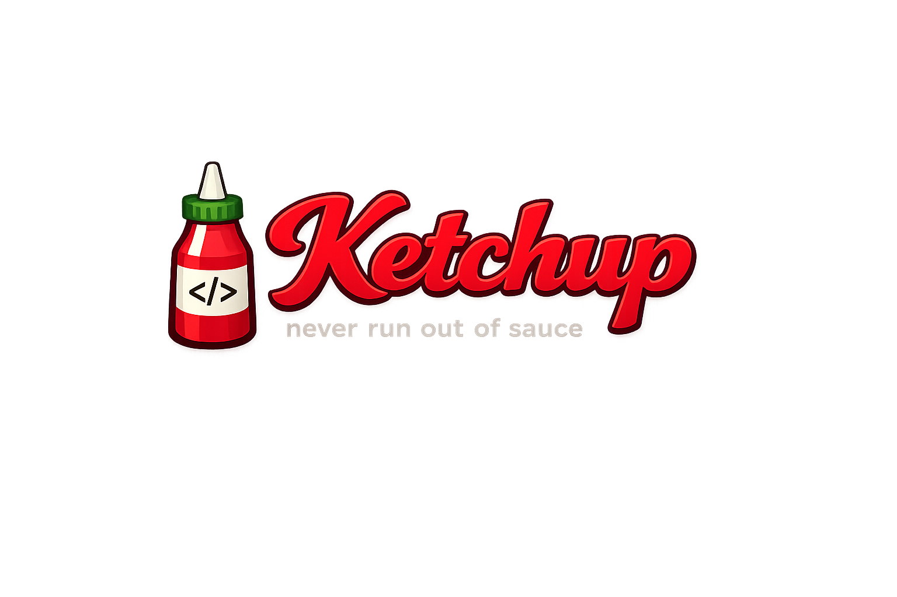

  

# FastForward (`ff`)

FastForward é uma CLI conservadora para detectar drift entre o ambiente local
de um desenvolvedor e o estado esperado do projeto.

A primeira versão se concentra em três providers:

- Git: reportar o drift da branch e permitir apenas atualizações fast-forward;
- Dependencies: detectar lockfiles recebidos e instalar somente no `ff sync`;
- Environment: comparar nomes de variáveis sem jamais exibir seus valores.

Segurança é parte central do produto. Checks e planos não alteram o ambiente,
mudanças locais nunca são descartadas e toda operação aplicada precisa vir de
um plano confirmado cujas precondições ainda sejam válidas.

## Estado atual

O MVP 0.1 está na etapa de desenho. Arquitetura, contratos, critérios de pronto
e roadmap de implementação estão documentados em
[`docs/mvp-0.1-design.md`](docs/mvp-0.1-design.md).

Uma configuração de exemplo está disponível em
[`.fastforward.example.yaml`](.fastforward.example.yaml).
